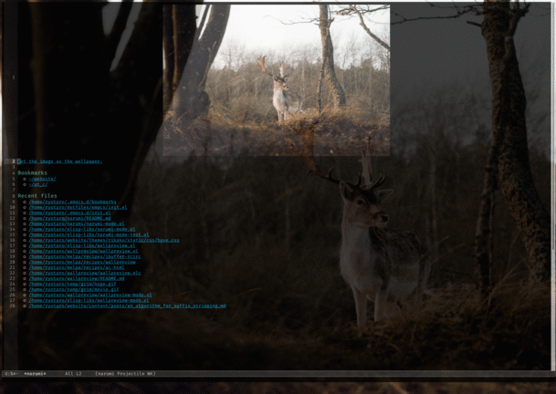

# narumi

## Abstract
narumi is a major mode for a dashboard.
It shows random sampled image in a directry, bookmarks, and recent files.
You can change the wallpaper to the image on the dashboard.
Since it is a dashboard, you can go to the entries of bookmarks and recent files by clicking them.
The following image is a screenshot of the mode.



## Installation

You can install the package from Melpa:

M-x package-install RET narumi

## Usage

narumi selects an image in the customizable variable `narumi-image-directory` at ramdom.
It refreshses the dashboard  when you type `r`.
When you type `RET` on `""Set the image as the wallpaper."`, narumi passes the file path to customized variable `narumi-wallpaper-cmd`.
The default function is for sway users, and the body is as below.

```
(defun narumi--sway-bg (wallpaper-path)
  "Use the image at `WALLPAPER-PATH' as the wallpaper.
This works for sway users."
  (concat "swaymsg output \"*\" bg \""
	  (shell-quote-argument wallpaper-path)
	  "\" fill"))
```
